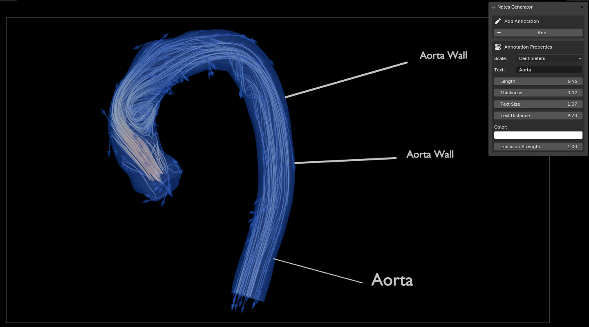

# SciBlend: Notes Generator for Blender

This script is an add-on for Blender that serves as a powerful 3D annotation tool, particularly useful for scientific visualizations. It allows users to create and apply customizable annotations to 3D objects, enhancing the visualization of data in Blender.

## Table of Contents

1. [Requirements](#requirements)
2. [Features](#features)
3. [Install the Add-on](#install-the-add-on)
4. [Usage](#usage)
   - [Accessing the Add-on Panel](#1-accessing-the-add-on-panel)
   - [Creating an Annotation](#2-creating-an-annotation)
   - [Customizing Annotations](#3-customizing-annotations)
5. [Tips for Best Results](#tips-for-best-results)
6. [Contributing](#contributing)

## Requirements

Before installing Blender and the add-on, ensure that you meet the following requirements:

1. **Operating System**: 
    - Any OS that supports Blender 4.2 (Windows, macOS, Linux)
  
2. **Blender**:
    - Blender 4.2 or higher

3. **Python**:
    - Python 3.11 (bundled with Blender 4.2)
    
## Features

- **3D Annotations**: Create annotations directly in 3D space.
- **Customizable Appearance**: Adjust annotation length, thickness, text size, and color.
- **Emission Materials**: Use emission materials for better visibility in different lighting conditions.
- **Camera-Facing Text**: Text automatically orients towards the camera for readability.
- **Non-Destructive**: Annotations are separate objects, preserving your original models.
- **Scale Options**: Choose from various scale options (mm, cm, dm, m, dam, hm, km) for precise annotations.
- **Scientific Visualization**: Designed specifically for enhancing scientific data representation in Blender.

## Install the Add-on

1. **Package the Script**:
    - Place all the provided script files into a folder named `NotesGenerator`.
    - Compress this folder into a ZIP file. Make sure the ZIP file is also named `NotesGenerator.zip`.

2. **Install the Add-on in Blender**:
    - Open Blender and go to `Edit > Preferences > Add-ons`.
    - Click on `Install...` and select the `NotesGenerator.zip` file you just created.
    - Enable the add-on by checking the box next to `3D View: NotesGenerator`.

3. **Using the Add-on**:
    - Access the add-on from the `3D Viewport` sidebar under the `Notes Generator` tab.
    - Configure your annotations and apply them to your scientific data visualizations.

      

## Usage

Once the add-on is installed and enabled, you can use it to generate and apply 3D annotations in Blender:

1. In the 3D Viewport, open the sidebar (N key) and find the "Notes Generator" tab.

2. Adjust the annotation properties as needed:
   - Scale (mm, cm, dm, m, dam, hm, km)
   - Text content
   - Length
   - Thickness
   - Text size
   - Text distance
   - Color
   - Emission strength

3. Click "Add" to create a new annotation.

4. Click on your 3D object where you want to place the annotation.

## Tips for Best Results

- Use emission strength to make annotations stand out in darker scenes.
- Adjust the text distance to prevent clipping with the annotated object.
- For temporal data, consider using multiple annotations and animating their visibility.
- Combine this add-on with Blender's built-in tools for more complex visualizations.

## Contributing

Contributions are welcome! Feel free to open issues or submit pull requests to improve this project.
